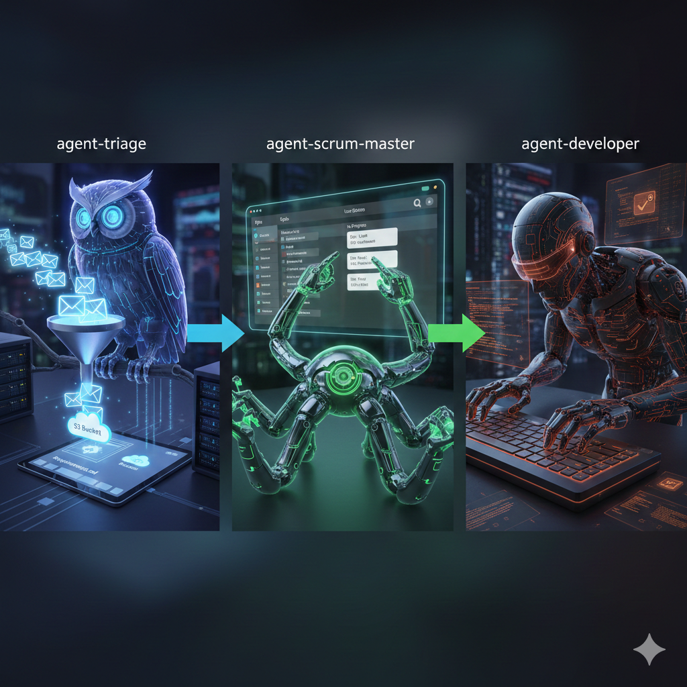

# Jarvis

Jarvis is a small multi-agent system that automates the flow from inbound
requirements emails to working code. It contains three specialised agents that
collaborate to convert human requests into deployable software artifacts.

**Quick summary:**
- **agent-triage**: polls a mailbox for `[JARVIS]-[...]` emails, parses structured
	request content and attachments, and stores requirements and epics in S3.
- **agent-scrum-master**: consumes S3 events / requirements, creates epics and
	user stories (e.g. on a Trello/MCP-backed board), and orchestrates planning.
- **agent-developer**: implements user stories, runs tests, and opens pull
	requests on GitHub to propose and merge changes.

See the agent-specific README for implementation details (examples, env vars,
and run instructions): [agents/agent-triage/README.md](agents/agent-triage/README.md).

## Technology stack

- Python 3.13
- Docker / Docker Compose
- GitHub Copilot SDK (Copilot CLI + SDK)
- MinIO (S3-compatible object storage)
- structlog / pydantic-settings / boto3
- pytest for unit and end-to-end tests

## Agents

- **agent-triage** — email-based intake
	- Polls IMAP for messages with subjects like `[JARVIS]-[Project Name]`.
	- Parses structured body tags (`[title]`, `[idea]`, `[envs]`, `[directives]`).
	- Stores generated requirements and optional `project-extension-rules.md`
		into per-project MinIO buckets.
	- See [agents/agent-triage/README.md](agents/agent-triage/README.md) for
		runtime configuration, Docker build/run instructions, and tests.

- **agent-scrum-master** — planning & orchestration
	- Listens to S3 bucket notifications for new/updated requirement artifacts.
	- Translates requirements into epics and user stories and places them on a
		Kanban board (via an MCP server, Trello or similar).

- **agent-developer** — implementation & PR automation
	- Picks user stories from the backlog, implements the feature, runs tests,
		and opens pull requests on GitHub with the proposed changes.

---

For contributor notes, running tests and CI/CD details, see the agent
READMEs under `agents/` and the repository `.github/workflows/` directory.
