# Agent Triage Frontend

A Next.js web application for creating and managing email requirements for the JARVIS agent-triage system.

## Overview

The Agent Triage Frontend provides a user-friendly interface for:
- **Creating email requirements**: A form-based interface to draft structured emails with project metadata
- **Managing pending emails**: View and interact with emails awaiting triage (password-protected)
- **Two-column layout**: Email creation form (always visible) and pending emails viewer (password-protected)

The application is designed as a Single Page Application (SPA) with server-side API routes for secure operations like IMAP authentication.

## Features

- **Create Email Requirements**: Form-based interface to draft email requirements with structured fields:
  - Project Name (required)
  - Title (required)
  - Idea/Description (required)
  - Directives (optional)
  - Environment Variables (optional)
  - Real-time validation and preview modal

- **Download as Email**: Generate and download formatted email in `.txt` format ready to send to the agent
  - Email is formatted in the exact structure expected by agent-triage
  - Download can be sent to the agent's mailbox

- **Password-Protected Email List**: View pending emails after entering the admin password
  - Form remains visible to everyone
  - Email list requires authentication with `NEXT_ADMIN_KEY`
  - One-time authentication per session

- **View Pending Emails**: Connect to IMAP server to fetch and display emails awaiting triage
  - View email metadata (subject, sender, date)
  - Click to view detailed email content in modal
  - See parsed email fields (title, idea, directives, environment variables)
  - Refresh button to manually fetch latest emails

## Application Flow

### User Access Flow


### Email Creation Flow

```mermaid
graph LR
    User["👤 User"] --> Form["📋 Email Form"]
    Form --> Validate["✓ Validate Fields"]
    Validate --> Preview["👁️ Preview Modal"]
    Preview --> Format["🎯 Format Email"]
    Format --> Download["⬇️ Download .txt"]
    Download --> Send["📬 Send to Agent<br/>via Email Client"]
    Send --> Inbox["📥 Agent-Triage Inbox"]
```



### Email Fetching & Viewing Flow

```mermaid
graph LR
    IMAP["📧 IMAP Server"] --> Fetch["🔄 Fetch Emails<br/>Prefix: JARVIS-"]
    Fetch --> Parse["📖 Parse Email Body<br/>Extract: title, idea,<br/>directives, envs"]
    Parse --> Display["📊 Display in List"]
    Display --> Click["👆 Click Email"]
    Click --> Modal["🖼️ View Details<br/>Full Content Modal"]
    Refresh["🔄 Refresh Button"] --> Fetch
```



### Authentication Architecture

```mermaid
graph TD
    Client["🌐 Browser Client"] -->|POST /password| API["🔐 Auth API Route"]
    API -->|Read Env| Env["NEXT_ADMIN_KEY"]
    Env -->|Compare| Verify["Verify Password"]
    Verify -->|Match| Success["✅ Return success: true"]
    Verify -->|No Match| Fail["❌ Return error: 401"]
    Success -->|Set State| Unlock["Unlock Email List"]
    Fail -->|Show Error| Retry["Retry Password Entry"]
    Retry --> API
```



### Component Architecture

```mermaid
graph TB
    Page["📄 page.tsx<br/>Main Container"]
    Page -->|Always Visible| Form["📋 EmailForm Component<br/>- Form validation<br/>- Preview modal<br/>- Download handler"]
    Page -->|Conditional| Auth{isAuthenticated?}
    Auth -->|false| Gate["🔐 PasswordGate Component<br/>- Password input<br/>- API verification<br/>- Error messages"]
    Auth -->|true| Emails["📧 PendingEmails Component<br/>- Fetch from /api/emails<br/>- Display email list<br/>- Refresh button"]
    Emails -->|Click| Detail["👁️ EmailDetail Component<br/>- Modal popup<br/>- Show parsed fields<br/>- Close handler"]
    Form -.->|lib/emailFormatter.ts<br/>Format & Download| Download["⬇️ .txt File"]
    Emails -->|fetch| APIRoute["🔌 /api/emails Route<br/>- Call fetchPendingEmails<br/>- Error handling<br/>- User-friendly messages"]
    APIRoute -->|Use| IMAPClient["📨 imapClient.ts<br/>- IMAP connection<br/>- Email parsing<br/>- Tag extraction"]
    Gate -->|POST| VerifyRoute["🔐 /api/auth/verify<br/>- Password validation<br/>- NEXT_ADMIN_KEY check"]
```



## Setup

### Prerequisites

- Node.js 18+ and npm
- IMAP email server access with credentials

### Installation

```bash
cd agents/agent-triage/frontend
npm install
```

### Configuration

1. Copy `.env.example` to `.env.local`:

```bash
cp .env.example .env.local
```

2. Edit `.env.local` with your IMAP server credentials:

```env
NEXT_PUBLIC_IMAP_HOST=mail.example.com
NEXT_PUBLIC_IMAP_PORT=993
NEXT_PUBLIC_IMAP_USE_SSL=true
NEXT_PUBLIC_IMAP_USERNAME=your-email@example.com
IMAP_PASSWORD=your-password
NEXT_PUBLIC_IMAP_MAILBOX=INBOX
NEXT_PUBLIC_EMAIL_SUBJECT_PREFIX=[JARVIS]-
NEXT_ADMIN_KEY=your-admin-password
```

**Note**: 
- The `IMAP_PASSWORD` variable is server-side only and never exposed to the browser.
- The `NEXT_ADMIN_KEY` is the password required to view the pending emails list (the form is always visible).

### Running the Development Server

```bash
npm run dev
```

Open [http://localhost:3000](http://localhost:3000) in your browser.

## Usage

### Creating a New Email Requirement

1. The **Email Form** is always visible on the left side of the application

2. Fill in the form fields:
   - **Project Name**: The project identifier (e.g., "Project Phoenix")
   - **Title**: Concise project title
   - **Idea**: Detailed description of requirements, features, and functionalities
   - **Directives** (optional): Technical instructions, frameworks, coding standards, etc. (one per line)
   - **Environment Variables** (optional): Key-value pairs needed for the project

2. Click **Preview** to see the formatted email before downloading

3. Click **Download Email** to save the formatted email as a `.txt` file

4. Send the downloaded email to the agent-triage mailbox

### Viewing Pending Emails (Password Protected)

1. The **Pending Emails** section on the right requires authentication

2. Enter the admin password (`NEXT_ADMIN_KEY`) in the password gate

3. If correct, the section will load emails matching the `[JARVIS]-` prefix from your IMAP mailbox

4. Click on any email to view its details in a modal:
   - Full subject and sender information
   - Parsed email fields (title, idea, directives, environment variables)

5. Click **Refresh** to manually fetch the latest emails from the server

6. Your authentication persists for the session (no need to re-enter password until page refresh)

## Email Format

The application generates emails in the format expected by agent-triage:

```
Subject: [JARVIS]-[Project Name]

[title]
Project Title Here

[idea]
Detailed description of the project requirements...

[envs]
DATABASE_URL: URL of the database
SECRET_KEY: Key for securing the application

[directives]
- Use Django framework
- Follow PEP 8 coding standards
- Implement unit tests
```

## Technologies

- **Framework**: Next.js 16+ with App Router
- **UI**: React 19+
- **Styling**: Tailwind CSS
- **Email**: IMAP client for fetching emails, mailparser for parsing
- **Language**: TypeScript

## Environment Variables

### Public Variables (exposed to browser)
- `NEXT_PUBLIC_IMAP_HOST`: IMAP server hostname
- `NEXT_PUBLIC_IMAP_PORT`: IMAP server port
- `NEXT_PUBLIC_IMAP_USE_SSL`: Whether to use SSL/TLS
- `NEXT_PUBLIC_IMAP_USERNAME`: IMAP username
- `NEXT_PUBLIC_IMAP_MAILBOX`: Mailbox to poll (default: INBOX)
- `NEXT_PUBLIC_EMAIL_SUBJECT_PREFIX`: Email subject prefix filter (default: [JARVIS]-)

### Server-Side Variables (never exposed to browser)
- `IMAP_PASSWORD`: IMAP password (sensitive - kept server-side only)
- `NEXT_ADMIN_KEY`: Admin password to unlock the pending emails list (never exposed to browser)

## Development

```bash
# Run development server with hot reload
npm run dev

# Build production bundle
npm run build

# Start production server
npm start

# Run linter
npm run lint
```

## Project Structure

```
frontend/
├── app/
│   ├── api/
│   │   ├── emails/              # API endpoint for fetching emails
│   │   │   └── route.ts         # Email fetching with error handling
│   │   └── auth/
│   │       └── verify/          # API endpoint for password verification
│   │           └── route.ts     # Password validation against NEXT_ADMIN_KEY
│   ├── page.tsx                 # Main page component (with authentication state)
│   ├── layout.tsx               # Root layout
│   └── globals.css              # Global styles
├── components/
│   ├── EmailForm.tsx            # Email creation form with validation & preview
│   ├── PendingEmails.tsx        # List of pending emails (protected)
│   ├── EmailDetail.tsx          # Email detail modal viewer
│   └── PasswordGate.tsx         # Password authentication component
├── lib/
│   ├── emailFormatter.ts        # Email formatting & download utilities
│   └── imapClient.ts            # IMAP client for fetching emails
├── .env.example                 # Environment variables template
├── .env.local                   # Local environment configuration (not committed)
├── package.json
└── tsconfig.json
```

## Security Considerations

- **IMAP Password**: Stored in environment variables and only accessed server-side via API routes. Never exposed to the browser.
- **Admin Password**: The `NEXT_ADMIN_KEY` is used only to gate access to the email list viewer. It is verified server-side in the `/api/auth/verify` endpoint.
- **Email Parsing**: Done server-side to prevent exposing raw email content to the browser unnecessarily.
- **Non-root User**: The Docker container runs as a non-root user for security.

## License

Part of the JARVIS project. See main project LICENSE for details.
